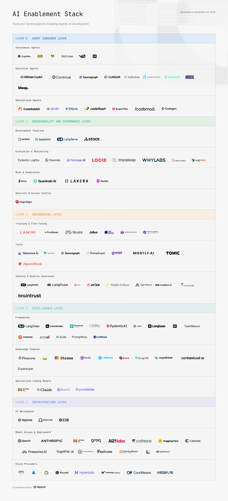

<h1 align="center">
	🔮 AI Enablement Stack 🔮
	

		
		
	

</h1>

<h3 align="center">
  A comprehensive list of tools and technologies for enabling agentic AI development
</h3>

<h5 align="center">👉 <a href="CONTRIBUTING.md">Contribute New Company/Product</a></h5>

Welcome to AI Enablement Stack mapping.
The list is structured into layers based on their functionality in the agentic AI development ecosystem:

**Agent Consumer Layer**: The interface layer where AI agents interact with users and systems. This includes standalone autonomous agents, assistive tools that enhance human capabilities, and specialized agents built for specific tasks. It's where AI capabilities are packaged into practical, user-facing applications.

**Observability and Governance Layer**: The control layer for monitoring, evaluating, securing, and governing AI systems. This layer handles everything from development pipelines and performance monitoring to risk management and compliance. It ensures AI systems operate reliably and meet organizational standards.

**Engineering Layer**: The developer's toolkit for building AI applications. This layer provides essential resources for training models, developing applications, and ensuring quality through testing. It provides tools and methods for transforming raw AI capabilities into production-ready solutions.

**Intelligence Layer**: The cognitive core of AI systems. This layer contains the frameworks, knowledge engines, and specialized models that power AI applications. It manages the actual processing, decision-making, and information retrieval that makes AI systems intelligent.

**Infrastructure Layer**: The foundation that powers AI development and deployment. This includes development workspaces, model serving infrastructure, and cloud computing resources. It provides the essential computing backbone that supports all AI operations.

## How to Contribute

To contribute to this list:

0. Read the <a href="CONTRIBUTING.md">CONTRIBUTING.md</a>
1. Fork the repository
2. Add logo under the assets folder
3. Add your tool in the appropriate category in the file ai-enablement-stack.json
4. Submit a pull request

## Agent Consumer Layer

### AUTONOMOUS AGENTS

Self-operating AI systems that can complete complex tasks independently

#### [Devin](https://devin.ai/)

##### Category
Agent Consumer Layer - AUTONOMOUS AGENTS

##### Description
Cognition develops Devin, the world's first AI software engineer, designed to work as a collaborative teammate that helps engineering teams scale their capabilities through parallel task execution and comprehensive development support.

##### Links
- [https://devin.ai/](https://devin.ai/)

#### [OpenHands]()

##### Category
Agent Consumer Layer - AUTONOMOUS AGENTS

##### Description
- No description available

##### Links

#### [Lovable]()

##### Category
Agent Consumer Layer - AUTONOMOUS AGENTS

##### Description
- No description available

##### Links

#### [AutoGen]()

##### Category
Agent Consumer Layer - AUTONOMOUS AGENTS

##### Description
- No description available

##### Links

#### [BabyAGI]()

##### Category
Agent Consumer Layer - AUTONOMOUS AGENTS

##### Description
- No description available

##### Links

#### [AgentGPT]()

##### Category
Agent Consumer Layer - AUTONOMOUS AGENTS

##### Description
- No description available

##### Links

#### [Superagent]()

##### Category
Agent Consumer Layer - AUTONOMOUS AGENTS

##### Description
- No description available

##### Links

#### [Morph]()

##### Category
Agent Consumer Layer - AUTONOMOUS AGENTS

##### Description
Morph AI delivers an enterprise-grade developer assistant that automates engineering tasks across multiple languages and frameworks, enabling developers to focus on high-impact work while ensuring code quality through automated testing and compliance.

##### Links

#### [GoCharlie](https://gocharlie.ai/)

##### Category
Agent Consumer Layer - AUTONOMOUS AGENTS

##### Description
Multimodal content creation autonomous agent.

##### Links
- [https://gocharlie.ai/](https://gocharlie.ai/)

#### [Kubiya](https://www.kubiya.ai/)

##### Category
Agent Consumer Layer - AUTONOMOUS AGENTS

##### Description
Kubiya provides AI-powered teammates for operations teams, enabling automated task delegation and execution across DevOps workflows, with hallucination-free operations, enterprise-grade security, and native integration with tools like Slack, Jira, and Terraform.

##### Links
- [https://www.kubiya.ai/](https://www.kubiya.ai/)

### ASSISTIVE AGENTS

AI tools that enhance human capabilities and workflow efficiency

#### [Copilot]()

##### Category
Agent Consumer Layer - ASSISTIVE AGENTS

##### Description
- No description available

##### Links

#### [Continue.dev]()

##### Category
Agent Consumer Layer - ASSISTIVE AGENTS

##### Description
- No description available

##### Links

#### [Cody](https://sourcegraph.com/cody)

##### Category
Agent Consumer Layer - ASSISTIVE AGENTS

##### Description
Sourcegraph's Cody is an AI coding assistant that combines the latest LLM models (including Claude 3 and GPT-4) with comprehensive codebase context to help developers write, understand, and fix code across multiple IDEs, while offering enterprise-grade security and flexible deployment options.

##### Links
- [https://sourcegraph.com/cody](https://sourcegraph.com/cody)

#### [Cursor]()

##### Category
Agent Consumer Layer - ASSISTIVE AGENTS

##### Description
- No description available

##### Links

#### [Tabnine](https://www.tabnine.com/)

##### Category
Agent Consumer Layer - ASSISTIVE AGENTS

##### Description
Tabnine provides a privacy-focused AI code assistant that offers personalized code generation, testing, and review capabilities, featuring bespoke models trained on team codebases, zero data retention, and enterprise-grade security with support for on-premises deployment.

##### Links
- [https://www.tabnine.com/](https://www.tabnine.com/)

#### [Pieces](https://pieces.app/)

##### Category
Agent Consumer Layer - ASSISTIVE AGENTS

##### Description
Pieces provides an on-device AI companion that captures and maintains long-term memory across the developer workflow, offering snippet management, multi-LLM support, and context-aware assistance while processing all data locally for enhanced security and privacy.

##### Links
- [https://pieces.app/](https://pieces.app/)

### SPECIALIZED AGENTS

Purpose-built AI agents designed for specific functions, like PR reviews and similar.

#### [CodeRabbit]()

##### Category
Agent Consumer Layer - SPECIALIZED AGENTS

##### Description
- No description available

##### Links

#### [Qodo]()

##### Category
Agent Consumer Layer - SPECIALIZED AGENTS

##### Description
- No description available

##### Links

#### [Ellipsis](https://www.ellipsis.dev/)

##### Category
Agent Consumer Layer - SPECIALIZED AGENTS

##### Description
Ellipsis provides AI-powered code reviews and automated bug fixes for GitHub repositories, offering features like style guide enforcement, code generation, and automated testing while maintaining SOC 2 Type 1 compliance and secure processing without data retention.

##### Links
- [https://www.ellipsis.dev/](https://www.ellipsis.dev/)

#### [Codeflash](https://www.codeflash.ai/)

##### Category
Agent Consumer Layer - SPECIALIZED AGENTS

##### Description
Codeflash is a CI tool that keeps your Python code performant by using AI to automatically find the most optimized version of your code through benchmarking and verifying the new code for correctness.

##### Links
- [https://www.codeflash.ai/](https://www.codeflash.ai/)

## Observability and Governance Layer

### DEVELOPMENT PIPELINE

Tools for managing and monitoring AI application lifecycles

#### [Portkey](https://portkey.ai/)

##### Category
Observability and Governance Layer - DEVELOPMENT PIPELINE

##### Description
Portkey provides a comprehensive AI gateway and control panel that enables teams to route to 200+ LLMs, implement guardrails, manage prompts, and monitor AI applications with detailed observability features while maintaining SOC2 compliance and HIPAA/GDPR standards.

##### Links
- [https://portkey.ai/](https://portkey.ai/)

#### [Baseten]()

##### Category
Observability and Governance Layer - DEVELOPMENT PIPELINE

##### Description
- No description available

##### Links

#### [LangServe]()

##### Category
Observability and Governance Layer - DEVELOPMENT PIPELINE

##### Description
- No description available

##### Links

#### [Kong]()

##### Category
Observability and Governance Layer - DEVELOPMENT PIPELINE

##### Description
- No description available

##### Links

#### [Apigee]()

##### Category
Observability and Governance Layer - DEVELOPMENT PIPELINE

##### Description
- No description available

##### Links

#### [Stack AI](https://www.stack-ai.com/)

##### Category
Observability and Governance Layer - DEVELOPMENT PIPELINE

##### Description
Stack AI provides an enterprise generative AI platform for building and deploying AI applications with a no-code interface, offering pre-built templates, workflow automation, enterprise security features (SOC2, HIPAA, GDPR), and on-premise deployment options with support for multiple AI models and data sources.

##### Links
- [https://www.stack-ai.com/](https://www.stack-ai.com/)

### EVALUATION & MONITORING

Systems for tracking AI performance and behavior

#### [Pydantic Logfire]()

##### Category
Observability and Governance Layer - EVALUATION & MONITORING

##### Description
- No description available

##### Links

#### [Cleanlab](https://cleanlab.ai/)

##### Category
Observability and Governance Layer - EVALUATION & MONITORING

##### Description
Cleanlab provides an AI-powered data curation platform that helps organizations improve their GenAI and ML solutions by automatically detecting and fixing data quality issues, reducing hallucinations, and enabling trustworthy AI deployment while offering VPC integration for enhanced security.

##### Links
- [https://cleanlab.ai/](https://cleanlab.ai/)

#### [Patronus](https://www.patronus.ai/)

##### Category
Observability and Governance Layer - EVALUATION & MONITORING

##### Description
Patronus provides a comprehensive AI evaluation platform built on industry-leading research, offering features for testing hallucinations, security risks, alignment, and performance monitoring, with both pre-built evaluators and custom evaluation capabilities for RAG systems and AI agents.

##### Links
- [https://www.patronus.ai/](https://www.patronus.ai/)

#### [Log10](https://www.log10.io/)

##### Category
Observability and Governance Layer - EVALUATION & MONITORING

##### Description
Log10 provides an end-to-end AI accuracy platform for evaluating and monitoring LLM applications in high-stakes industries, featuring expert-driven evaluation, automated feedback systems, real-time monitoring, and continuous improvement workflows with built-in security and compliance features.

##### Links
- [https://www.log10.io/](https://www.log10.io/)

#### [Traceloop](https://traceloop.com/)

##### Category
Observability and Governance Layer - EVALUATION & MONITORING

##### Description
Traceloop provides open-source LLM monitoring through OpenLLMetry, offering real-time hallucination detection, output quality monitoring, and prompt debugging capabilities across 22+ LLM providers with zero-intrusion integration.

##### Links
- [https://traceloop.com/](https://traceloop.com/)

#### [WhyLabs](https://whylabs.ai/)

##### Category
Observability and Governance Layer - EVALUATION & MONITORING

##### Description
WhyLabs provides a comprehensive AI Control Center for monitoring, securing, and optimizing AI applications, offering real-time LLM monitoring, security guardrails, and privacy-preserving observability with SOC 2 Type 2 compliance and support for multiple modalities.

##### Links
- [https://whylabs.ai/](https://whylabs.ai/)

#### [OpenLLMetry](https://openllmetry.org/)

##### Category
Observability and Governance Layer - EVALUATION & MONITORING

##### Description
OpenLLMetry provides an open-source observability solution for LLMs built on OpenTelemetry standards, offering easy integration with major observability platforms like Datadog, New Relic, and Grafana, requiring just two lines of code to implement.

##### Links
- [https://openllmetry.org/](https://openllmetry.org/)

### RISK & COMPLIANCE

Frameworks for ensuring responsible AI use and regulatory compliance

#### [Alinia]()

##### Category
Observability and Governance Layer - RISK & COMPLIANCE

##### Description
- No description available

##### Links

#### [Guardrails AI]()

##### Category
Observability and Governance Layer - RISK & COMPLIANCE

##### Description
- No description available

##### Links

#### [Lakera]()

##### Category
Observability and Governance Layer - RISK & COMPLIANCE

##### Description
- No description available

##### Links

### SECURITY & ACCESS CONTROL

Tools for protecting AI systems and managing access and user permissions

#### [LiteLLM](https://litellm.ai/)

##### Category
Observability and Governance Layer - SECURITY & ACCESS CONTROL

##### Description
LiteLLM provides a unified API gateway for managing 100+ LLM providers with OpenAI-compatible formatting, offering features like authentication, load balancing, spend tracking, and monitoring integrations, available both as an open-source solution and enterprise service.

##### Links
- [https://litellm.ai/](https://litellm.ai/)

## Engineering Layer

### TRAINING & FINE-TUNING

Resources for customizing and optimizing AI models

#### [Lamini](https://lamini.ai/)

##### Category
Engineering Layer - TRAINING & FINE-TUNING

##### Description
Provides tools for efficient fine-tuning of large language models, including techniques like quantization and memory optimization.

##### Links
- [https://lamini.ai/](https://lamini.ai/)

#### [Predibase](https://www.predibase.com/)

##### Category
Engineering Layer - TRAINING & FINE-TUNING

##### Description
Platform for building and deploying machine learning models, with a focus on simplifying the development process and enabling faster iteration.

##### Links
- [https://www.predibase.com/](https://www.predibase.com/)

#### [Bloop]()

##### Category
Engineering Layer - TRAINING & FINE-TUNING

##### Description
- No description available

##### Links

#### [Hex Magic]()

##### Category
Engineering Layer - TRAINING & FINE-TUNING

##### Description
- No description available

##### Links

#### [Julius]()

##### Category
Engineering Layer - TRAINING & FINE-TUNING

##### Description
- No description available

##### Links

#### [Flowise]()

##### Category
Engineering Layer - TRAINING & FINE-TUNING

##### Description
- No description available

##### Links

#### [LLM Stack]()

##### Category
Engineering Layer - TRAINING & FINE-TUNING

##### Description
- No description available

##### Links

#### [broadn]()

##### Category
Engineering Layer - TRAINING & FINE-TUNING

##### Description
- No description available

##### Links

#### [Fine Tuner]()

##### Category
Engineering Layer - TRAINING & FINE-TUNING

##### Description
- No description available

##### Links

#### [Codeanywhere]()

##### Category
Engineering Layer - TRAINING & FINE-TUNING

##### Description
Provides workspaces with GPU

##### Links

### TOOLS

Development utilities, libraries and services for building AI applications

#### [Codegen]()

##### Category
Engineering Layer - TOOLS

##### Description
- No description available

##### Links

#### [Hide.sh]()

##### Category
Engineering Layer - TOOLS

##### Description
- No description available

##### Links

#### [Relevance AI](https://relevanceai.com/)

##### Category
Engineering Layer - TOOLS

##### Description
Relevance AI provides a no-code AI workforce platform that enables businesses to build, customize, and manage AI agents and tools for various functions like sales and support, featuring Bosh, their AI Sales Agent, while ensuring enterprise-grade security and compliance.

##### Links
- [https://relevanceai.com/](https://relevanceai.com/)

#### [Greptile](https://www.greptile.com/)

##### Category
Engineering Layer - TOOLS

##### Description
Greptile provides an AI-powered code analysis platform that helps software teams ship faster by offering intelligent code reviews, codebase chat, and custom dev tools with full contextual understanding, while maintaining SOC2 Type II compliance and optional self-hosting capabilities.

##### Links
- [https://www.greptile.com/](https://www.greptile.com/)

#### [Sourcegraph](https://sourcegraph.com/)

##### Category
Engineering Layer - TOOLS

##### Description
Sourcegraph provides a code intelligence platform featuring Cody, an AI coding assistant, and advanced code search capabilities that help developers navigate, understand, and modify complex codebases while automating routine tasks across enterprise environments.

##### Links
- [https://sourcegraph.com/](https://sourcegraph.com/)

#### [PromptLayer](https://www.promptlayer.com/)

##### Category
Engineering Layer - TOOLS

##### Description
PromptLayer provides a comprehensive prompt engineering platform that enables technical and non-technical teams to collaboratively edit, evaluate, and deploy LLM prompts through a visual CMS, while offering version control, A/B testing, and monitoring capabilities with SOC 2 Type 2 compliance.

##### Links
- [https://www.promptlayer.com/](https://www.promptlayer.com/)

#### [Gretel.ai]()

##### Category
Engineering Layer - TOOLS

##### Description
- No description available

##### Links

#### [Mostly.ai]()

##### Category
Engineering Layer - TOOLS

##### Description
- No description available

##### Links

#### [Tonic.ai]()

##### Category
Engineering Layer - TOOLS

##### Description
- No description available

##### Links

#### [Rockfish.ai]()

##### Category
Engineering Layer - TOOLS

##### Description
- No description available

##### Links

#### [JigsawStack](https://www.jigsawstack.com/)

##### Category
Engineering Layer - TOOLS

##### Description
JigsawStack provides a comprehensive suite of AI APIs including web scraping, translation, speech-to-text, OCR, prediction, and prompt optimization, offering globally distributed infrastructure with type-safe SDKs and built-in monitoring capabilities across 99+ locations.

##### Links
- [https://www.jigsawstack.com/](https://www.jigsawstack.com/)

### TESTING & QUALITY ASSURANCE

Systems for validating AI performance and reliability

#### [LangSmith]()

##### Category
Engineering Layer - TESTING & QUALITY ASSURANCE

##### Description
- No description available

##### Links

#### [Galileo]()

##### Category
Engineering Layer - TESTING & QUALITY ASSURANCE

##### Description
- No description available

##### Links

#### [Arize]()

##### Category
Engineering Layer - TESTING & QUALITY ASSURANCE

##### Description
- No description available

##### Links

#### [Weight & Biases]()

##### Category
Engineering Layer - TESTING & QUALITY ASSURANCE

##### Description
- No description available

##### Links

#### [AgentOps]()

##### Category
Engineering Layer - TESTING & QUALITY ASSURANCE

##### Description
- No description available

##### Links

#### [Confident AI](https://www.confident-ai.com/)

##### Category
Engineering Layer - TESTING & QUALITY ASSURANCE

##### Description
Confident AI provides an LLM evaluation platform that enables organizations to benchmark, unit test, and monitor their LLM applications through automated regression testing, A/B testing, and synthetic dataset generation, while offering research-backed evaluation metrics and comprehensive observability features.

##### Links
- [https://www.confident-ai.com/](https://www.confident-ai.com/)

#### [ContextQA](https://contextqa.com/)

##### Category
Engineering Layer - TESTING & QUALITY ASSURANCE

##### Description
AI agent specifically designed for software testing and quality assurance, automating the testing process and providing comprehensive test coverage.

##### Links
- [https://contextqa.com/](https://contextqa.com/)

#### [Braintrust](https://www.braintrustdata.com/)

##### Category
Engineering Layer - TESTING & QUALITY ASSURANCE

##### Description
Braintrust provides an end-to-end platform for evaluating and testing LLM applications, offering features like prompt testing, custom scoring, dataset management, real-time tracing, and production monitoring, with support for both UI-based and SDK-driven workflows.

##### Links
- [https://www.braintrustdata.com/](https://www.braintrustdata.com/)

## Intelligence Layer

### FRAMEWORKS

Core libraries and building blocks for AI application development

#### [LangChain]()

##### Category
Intelligence Layer - FRAMEWORKS

##### Description
- No description available

##### Links

#### [LlamaIndex]()

##### Category
Intelligence Layer - FRAMEWORKS

##### Description
- No description available

##### Links

#### [Haystack]()

##### Category
Intelligence Layer - FRAMEWORKS

##### Description
- No description available

##### Links

#### [DSPy]()

##### Category
Intelligence Layer - FRAMEWORKS

##### Description
- No description available

##### Links

#### [Pydantic AI](https://ai.pydantic.dev/)

##### Category
Intelligence Layer - FRAMEWORKS

##### Description
- No description available

##### Links
- [https://ai.pydantic.dev/](https://ai.pydantic.dev/)

#### [Letta](https://www.letta.com/)

##### Category
Intelligence Layer - FRAMEWORKS

##### Description
Provides an agent development platform with advanced memory management for LLMs, enabling developers to build, deploy, and scale production-ready AI agents with transparent reasoning and model-agnostic flexibility.

##### Links
- [https://www.letta.com/](https://www.letta.com/)

#### [AutoGen](https://github.com/microsoft/autogen)

##### Category
Intelligence Layer - FRAMEWORKS

##### Description
Framework for developing LLM applications with multiple conversational agents that collaborate and interact with humans.

##### Links
- [https://github.com/microsoft/autogen](https://github.com/microsoft/autogen)

#### [TaskWeaver](https://github.com/microsoft/TaskWeaver)

##### Category
Intelligence Layer - FRAMEWORKS

##### Description
A framework for creating and managing workflows and tasks for AI agents.

##### Links
- [https://github.com/microsoft/TaskWeaver](https://github.com/microsoft/TaskWeaver)

#### [Toolhouse](https://toolhouse.io/)

##### Category
Intelligence Layer - FRAMEWORKS

##### Description
Toolhouse provides a cloud infrastructure platform and universal SDK that enables developers to equip LLMs with actions and knowledge through a Tool Store, offering pre-built optimized functions, low-latency execution, and cross-LLM compatibility with just three lines of code.

##### Links
- [https://toolhouse.io/](https://toolhouse.io/)

#### [Composio](https://www.composio.com/)

##### Category
Intelligence Layer - FRAMEWORKS

##### Description
Composio provides an integration platform for AI agents and LLMs with 250+ pre-built tools, managed authentication, and RPA capabilities, enabling developers to easily connect their AI applications with various services while maintaining SOC-2 compliance and supporting multiple agent frameworks.

##### Links
- [https://www.composio.com/](https://www.composio.com/)

#### [CrewAI](https://www.crewai.io/)

##### Category
Intelligence Layer - FRAMEWORKS

##### Description
CrewAI provides a comprehensive platform for building, deploying, and managing multi-agent AI systems, offering both open-source framework and enterprise solutions with support for any LLM and cloud platform, enabling organizations to create automated workflows across various industries.

##### Links
- [https://www.crewai.io/](https://www.crewai.io/)

### KNOWLEDGE ENGINES

Systems for managing and retrieving information

#### [Pinecone]()

##### Category
Intelligence Layer - KNOWLEDGE ENGINES

##### Description
- No description available

##### Links

#### [Weaviate]()

##### Category
Intelligence Layer - KNOWLEDGE ENGINES

##### Description
- No description available

##### Links

#### [Chroma]()

##### Category
Intelligence Layer - KNOWLEDGE ENGINES

##### Description
- No description available

##### Links

#### [Milvus]()

##### Category
Intelligence Layer - KNOWLEDGE ENGINES

##### Description
- No description available

##### Links

#### [Qdrant]()

##### Category
Intelligence Layer - KNOWLEDGE ENGINES

##### Description
- No description available

##### Links

#### [MongoDB Atlas]()

##### Category
Intelligence Layer - KNOWLEDGE ENGINES

##### Description
- No description available

##### Links

#### [Supabase]()

##### Category
Intelligence Layer - KNOWLEDGE ENGINES

##### Description
- No description available

##### Links

#### [Contextual AI](https://contextual.ai/)

##### Category
Intelligence Layer - KNOWLEDGE ENGINES

##### Description
Contextual AI provides enterprise-grade RAG (Retrieval-Augmented Generation) solutions that enable organizations in regulated industries to build and deploy production-ready AI applications for searching and analyzing large volumes of business-critical documents.

##### Links
- [https://contextual.ai/](https://contextual.ai/)

#### [Unstructured](https://unstructured.io/)

##### Category
Intelligence Layer - KNOWLEDGE ENGINES

##### Description
Platform for working with unstructured data, offering tools for data pre-processing, ETL, and integration with LLMs.

##### Links
- [https://unstructured.io/](https://unstructured.io/)

#### [Sciphi](https://www.sciphi.ai/)

##### Category
Intelligence Layer - KNOWLEDGE ENGINES

##### Description
SciPhi offers R2R, an all-in-one RAG (Retrieval Augmented Generation) solution that enables developers to build and scale AI applications with advanced features including document management, hybrid vector search, and knowledge graphs, while providing superior ingestion performance compared to competitors.

##### Links
- [https://www.sciphi.ai/](https://www.sciphi.ai/)

### SPECIALIZED CODING MODELS

AI models optimized for software development

#### [Codestral](https://mistral.ai/news/codestral/)

##### Category
Intelligence Layer - SPECIALIZED CODING MODELS

##### Description
Codestral is Mistral AI's specialized 22B code generation model supporting 80+ programming languages, featuring a 32k context window, fill-in-the-middle capabilities, and state-of-the-art performance on coding benchmarks, available through API endpoints and IDE integrations.

##### Links
- [https://mistral.ai/news/codestral/](https://mistral.ai/news/codestral/)

#### [Claude 3.5 Sonnet](https://www.anthropic.com/claude)

##### Category
Intelligence Layer - SPECIALIZED CODING MODELS

##### Description
Claude 3.5 Sonnet is Anthropic's frontier AI model offering state-of-the-art performance in reasoning, coding, and vision tasks, featuring a 200K token context window, computer use capabilities, and enhanced safety measures, available through multiple platforms including Claude.ai and major cloud providers.

##### Links
- [https://www.anthropic.com/claude](https://www.anthropic.com/claude)

#### [Qwen2.5-Coder-32B](https://huggingface.co/Qwen/Qwen2.5-Coder-32B)

##### Category
Intelligence Layer - SPECIALIZED CODING MODELS

##### Description
Qwen2.5-Coder is a specialized code-focused model matching GPT-4's coding capabilities, featuring 32B parameters, 128K token context window, support for 80+ programming languages, and state-of-the-art performance on coding benchmarks, available as an open-source Apache 2.0 licensed model.

##### Links
- [https://huggingface.co/Qwen/Qwen2.5-Coder-32B](https://huggingface.co/Qwen/Qwen2.5-Coder-32B)

## Infrastructure Layer

### WORKSPACES

Development environments for sandboxing and building AI applications

#### [Daytona](https://daytona.io/)

##### Category
Infrastructure Layer - WORKSPACES

##### Description
Daytona.io is an open-source Development Environment Manager designed to simplify the setup and management of development environments across various platforms, including local, remote, and cloud infrastructures.

##### Links
- [https://daytona.io/](https://daytona.io/)

#### [RunloopAI](https://www.runloop.ai/)

##### Category
Infrastructure Layer - WORKSPACES

##### Description
Runloop provides a secure, high-performance infrastructure platform that enables developers to build, scale, and deploy AI-powered coding solutions with seamless integration and real-time monitoring capabilities.

##### Links
- [https://www.runloop.ai/](https://www.runloop.ai/)

#### [E2B](https://e2b.dev/)

##### Category
Infrastructure Layer - WORKSPACES

##### Description
E2B provides an open-source runtime platform that enables developers to securely execute AI-generated code in cloud sandboxes, supporting multiple languages and frameworks for AI-powered development use cases.

##### Links
- [https://e2b.dev/](https://e2b.dev/)

#### [Modal](https://modal.com/)

##### Category
Infrastructure Layer - WORKSPACES

##### Description
Modal offers a serverless cloud platform for AI and ML applications that enables developers to deploy and scale workloads instantly with simple Python code, featuring high-performance GPU infrastructure and pay-per-use pricing.

##### Links
- [https://modal.com/](https://modal.com/)

### MODEL ACCESS & DEPLOYMENT

Services for deploying and running AI models

#### [OpenAI](https://openai.com/)

##### Category
Infrastructure Layer - MODEL ACCESS & DEPLOYMENT

##### Description
OpenAI develops advanced artificial intelligence systems like ChatGPT, GPT-4, and Sora, focusing on creating safe AGI that benefits humanity through products spanning language models, image generation, and video creation while maintaining leadership in AI research and safety.

##### Links
- [https://openai.com/](https://openai.com/)

#### [Anthropic](https://www.anthropic.com/)

##### Category
Infrastructure Layer - MODEL ACCESS & DEPLOYMENT

##### Description
Anthropic provides frontier AI models through the Claude family, emphasizing safety and reliability, with offerings including Claude 3.5 Sonnet and Haiku. Their models feature advanced capabilities in reasoning, coding, and computer use, while maintaining strong safety standards through Constitutional AI and comprehensive testing.

##### Links
- [https://www.anthropic.com/](https://www.anthropic.com/)

#### [Mistral AI](https://mistral.ai/)

##### Category
Infrastructure Layer - MODEL ACCESS & DEPLOYMENT

##### Description
Mistral AI provides frontier AI models with emphasis on openness and portability, offering both open-weight models (Mistral 7B, Mixtral 8x7B) and commercial models (Mistral Large 2), available through multiple deployment options including serverless APIs, cloud services, and on-premise deployment.

##### Links
- [https://mistral.ai/](https://mistral.ai/)

#### [Poolside](https://poolside.ai/)

##### Category
Infrastructure Layer - MODEL ACCESS & DEPLOYMENT

##### Description
Poolside provides a specialized AI foundation model (Malibu) built specifically for software engineering, featuring Reinforcement Learning from Code Execution Feedback, custom fine-tuning on company codebases, and a fully integrated development assistant with IDE support, all deployable within private infrastructure.

##### Links
- [https://poolside.ai/](https://poolside.ai/)

#### [Groq](https://groq.com/)

##### Category
Infrastructure Layer - MODEL ACCESS & DEPLOYMENT

##### Description
Groq provides ultra-fast AI inference infrastructure for openly-available models like Llama 3.1, Mixtral, and Gemma, offering OpenAI-compatible API endpoints with industry-leading speed and simple three-line integration for existing applications.

##### Links
- [https://groq.com/](https://groq.com/)

#### [AI21labs](https://www.ai21.com/)

##### Category
Infrastructure Layer - MODEL ACCESS & DEPLOYMENT

##### Description
AI21 Labs delivers enterprise-grade generative AI solutions through its Jamba foundation model and RAG engine, enabling organizations to build secure, production-ready AI applications with flexible deployment options and dedicated integration support.

##### Links
- [https://www.ai21.com/](https://www.ai21.com/)

#### [Cohere](https://cohere.com/)

##### Category
Infrastructure Layer - MODEL ACCESS & DEPLOYMENT

##### Description
Cohere provides an enterprise AI platform featuring advanced language models, embedding, and retrieval capabilities that enables businesses to build production-ready AI applications with flexible deployment options across cloud or on-premises environments.

##### Links
- [https://cohere.com/](https://cohere.com/)

#### [Hugging Face](https://huggingface.co/)

##### Category
Infrastructure Layer - MODEL ACCESS & DEPLOYMENT

##### Description
Hugging Face provides fully managed inference infrastructure for ML models with support for multiple hardware options (CPU, GPU, TPU) across various cloud providers, offering autoscaling and dedicated deployments with enterprise-grade security.

##### Links
- [https://huggingface.co/](https://huggingface.co/)

#### [Cartesia](https://www.cartesia.ai/)

##### Category
Infrastructure Layer - MODEL ACCESS & DEPLOYMENT

##### Description
Cartesia AI delivers real-time multimodal intelligence through state space models that enable fast, private, and offline inference capabilities across devices, offering streaming-first solutions with constant memory usage and low latency.

##### Links
- [https://www.cartesia.ai/](https://www.cartesia.ai/)

#### [Fireworks](https://fireworks.ai/)

##### Category
Infrastructure Layer - MODEL ACCESS & DEPLOYMENT

##### Description
Provides easy access to open-source language models through a simple API, similar to offerings from closed-source providers.

##### Links
- [https://fireworks.ai/](https://fireworks.ai/)

#### [Together.AI](https://together.ai/)

##### Category
Infrastructure Layer - MODEL ACCESS & DEPLOYMENT

##### Description
Offers an API for accessing and running open-source LLMs, facilitating seamless integration into AI applications.

##### Links
- [https://together.ai/](https://together.ai/)

#### [Google Vertex AI](https://cloud.google.com/vertex-ai)

##### Category
Infrastructure Layer - MODEL ACCESS & DEPLOYMENT

##### Description
End-to-end platform for deploying and managing AI models, including LLMs, with integrated tools for monitoring, versioning, and scaling.

##### Links
- [https://cloud.google.com/vertex-ai](https://cloud.google.com/vertex-ai)

#### [Amazon Nova](https://aws.amazon.com/ai/generative-ai/nova/)

##### Category
Infrastructure Layer - MODEL ACCESS & DEPLOYMENT

##### Description
Amazon Nova provides state-of-the-art foundation models through Amazon Bedrock, offering multiple model variants (Micro, Lite, Pro, Canvas, Reel) for text, image, and video processing with industry-leading price-performance, fine-tuning capabilities, and enterprise-grade features.

##### Links
- [https://aws.amazon.com/ai/generative-ai/nova/](https://aws.amazon.com/ai/generative-ai/nova/)

#### [Replicate](https://replicate.com/)

##### Category
Infrastructure Layer - MODEL ACCESS & DEPLOYMENT

##### Description
Serverless platform for running machine learning models, allowing developers to deploy and scale models without managing infrastructure.

##### Links
- [https://replicate.com/](https://replicate.com/)

#### [SambaNova](https://sambanova.ai/)

##### Category
Infrastructure Layer - MODEL ACCESS & DEPLOYMENT

##### Description
SambaNova provides custom AI infrastructure featuring their SN40L Reconfigurable Dataflow Unit (RDU), offering world-record inference speeds for large language models, with integrated fine-tuning capabilities and enterprise-grade security, delivered through both cloud and on-premises solutions.

##### Links
- [https://sambanova.ai/](https://sambanova.ai/)

#### [BentoML](https://www.bentoml.com/)

##### Category
Infrastructure Layer - MODEL ACCESS & DEPLOYMENT

##### Description
BentoML provides an open-source unified inference platform that enables organizations to build, deploy, and scale AI systems across any cloud with high performance and flexibility, while offering enterprise features like auto-scaling, rapid iteration, and SOC II compliance.

##### Links
- [https://www.bentoml.com/](https://www.bentoml.com/)

### CLOUD PROVIDERS

Computing infrastructure that powers AI systems and their workspaces

#### [Nvidia]()

##### Category
Infrastructure Layer - CLOUD PROVIDERS

##### Description
- No description available

##### Links

#### [AMD]()

##### Category
Infrastructure Layer - CLOUD PROVIDERS

##### Description
- No description available

##### Links

#### [Intel]()

##### Category
Infrastructure Layer - CLOUD PROVIDERS

##### Description
- No description available

##### Links

#### [SambaNova]()

##### Category
Infrastructure Layer - CLOUD PROVIDERS

##### Description
- No description available

##### Links

#### [AWS]()

##### Category
Infrastructure Layer - CLOUD PROVIDERS

##### Description
- No description available

##### Links

#### [Azure]()

##### Category
Infrastructure Layer - CLOUD PROVIDERS

##### Description
- No description available

##### Links

#### [GCP]()

##### Category
Infrastructure Layer - CLOUD PROVIDERS

##### Description
- No description available

##### Links

#### [Koyeb](https://www.koyeb.com/)

##### Category
Infrastructure Layer - CLOUD PROVIDERS

##### Description
Koyeb provides a high-performance serverless platform specifically optimized for AI workloads, offering GPU/NPU infrastructure, global deployment across 50+ locations, and seamless scaling capabilities for ML model inference and training with built-in observability.

##### Links
- [https://www.koyeb.com/](https://www.koyeb.com/)

## Contributing
Please read the [contribution guidelines](CONTRIBUTING.md) before submitting a pull request.

## License
This project is licensed under the Apache 2.0 License - see the [LICENSE](LICENSE) file for details
